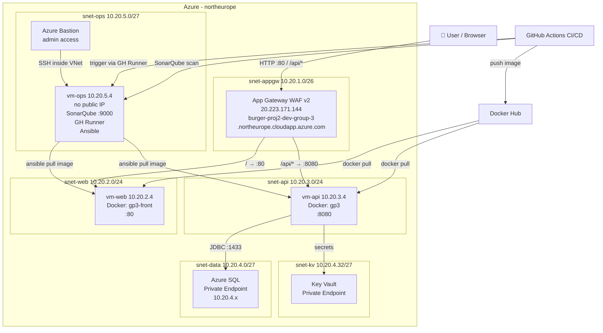

```mermaid
graph TD
    User["👤 User / Browser"]
    GH["GitHub Actions CI/CD"]
    DH["Docker Hub"]

    subgraph Azure - northeurope
        subgraph snet-appgw 10.20.1.0/26
            AGW["App Gateway WAF v2\n20.223.171.144\nburger-proj2-dev-group-3\n.northeurope.cloudapp.azure.com"]
        end

        subgraph snet-web 10.20.2.0/24
            WEB["vm-web 10.20.2.4\nDocker: gp3-front\n:80"]
        end

        subgraph snet-api 10.20.3.0/24
            API["vm-api 10.20.3.4\nDocker: gp3\n:8080"]
        end

        subgraph snet-data 10.20.4.0/27
            SQL["Azure SQL\nPrivate Endpoint\n10.20.4.x"]
        end

        subgraph snet-kv 10.20.4.32/27
            KV["Key Vault\nPrivate Endpoint"]
        end

        subgraph snet-ops 10.20.5.0/27
            OPS["vm-ops 10.20.5.4\nno public IP\nSonarQube :9000\nGH Runner\nAnsible"]
            BAS["Azure Bastion\nadmin access"]
        end
    end

    User -->|"HTTP :80 / /api/*"| AGW
    AGW -->|"/ → :80"| WEB
    AGW -->|"/api/* → :8080"| API
    API -->|"JDBC :1433"| SQL
    API -->|"secrets"| KV
    GH -->|"push image"| DH
    GH -->|"trigger via GH Runner"| OPS
    OPS -->|"ansible pull image"| WEB
    OPS -->|"ansible pull image"| API
    DH -->|"docker pull"| WEB
    DH -->|"docker pull"| API
    GH -->|"SonarQube scan"| OPS
    BAS -->|"SSH inside VNet"| OPS
```

> **Export to PNG:** Open this file in any Mermaid renderer (GitHub, VS Code Mermaid extension, mermaid.live) and screenshot/export as `architecture-diagram.png`.
